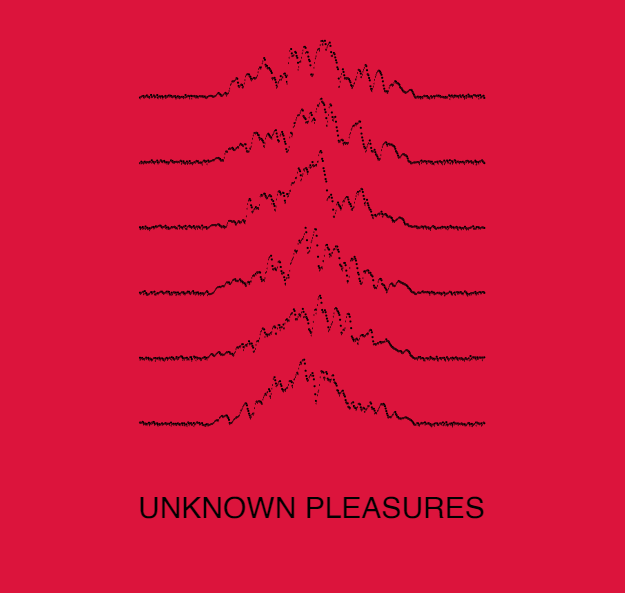
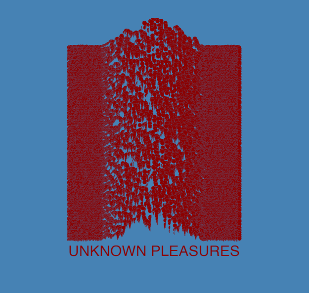

# Recodage de “Unknown Pleasures”

- [@MrzozoGit](https://github.com/MrzozoGit)
- [@GuilhemDuval](https://github.com/GuilhemDuval)

## Contexte

“Joy Division” est un groupe de rock britannique de la fin des années 80. Leur musique est froide, claustrophobique et lugubre. La couverture de leur album, “Unknow Pleasures”, reflète cette peur et cette admiration du vide.

Le graphiste Peter Saville rencontre en 1979 une illustration dans un livre d’astronomie. C’est le signal d’une étoile pulsar. Il reprend ainsi l’image et inverse les couleurs pour créer un motif minimaliste. L’album et sa pochette deviennent cultes et intemporels.

## Analyse visuelle

L’illustration prend place sur un fond complétement noir. Quatre-vingts lignes blanches dessinent des formes de signal perturbé.

Que représentent-elles ? L’illustration est ouverte à l’interprétation.

De plus, l’aplat sombre contraste avec les fragiles courbes. Sa perturbation s’oppose à la composition épurée et mathématique. 

## Pseudocode

Nous gérons chaque ligne une à une et les points de chaque ligne individuellement. 

À chaque point, nous calculons une valeur de bruit. Suivant l’avancement horizontal dans la ligne, la valeur de bruit déplace verticalement le point. Plus les points sont proches du milieu du signal, plus ils sont impactés par le bruit.

Tous les points forment ensemble une ligne. Nous recommençons ensuite le processus pour toutes les lignes.

## Variations

Pour composer des variations, nous avons déconstruit notre code. Des curseurs impactent plusieurs paramètres. Grâce à cet outil interactif, l’utilisateur et nous-mêmes pouvons générer une infinité d’illustrations inspirées de l’originale.

Une variation supplémentaire transforme l’illustration en visualiseur de musique. Cela référence à la fois le contexte musical de l’illustration et son origine en tant que signal.

